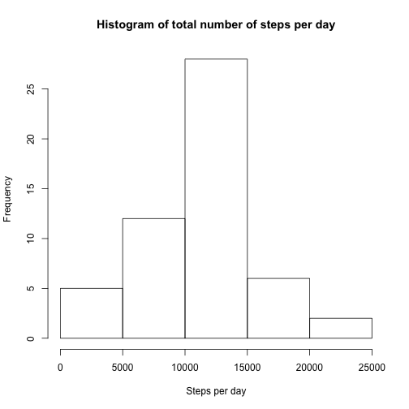
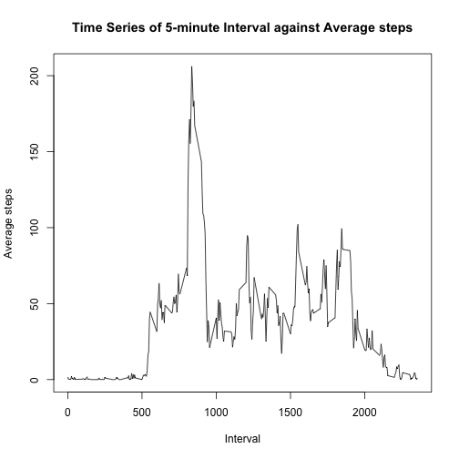
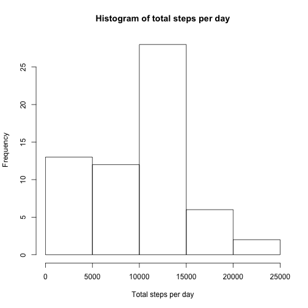
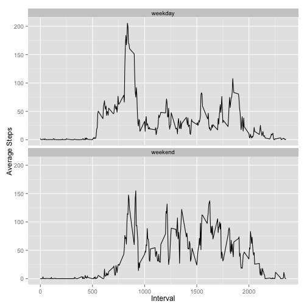

## Loading and preprocessing the data


```r
library(dplyr)
```

```
## 
## Attaching package: 'dplyr'
## 
## The following objects are masked from 'package:stats':
## 
##     filter, lag
## 
## The following objects are masked from 'package:base':
## 
##     intersect, setdiff, setequal, union
```

```r
unzip('activity.zip')
activity <- read.csv('activity.csv',header=TRUE)
activity <- tbl_df(activity)
```

## What is the mean total number of steps taken per day?
For this task, I ignore missing values.  

1. Calculate the total number of steps taken per day  


```r
# Only consider complete cases, i.e. no missing values
stepsperday <- filter(activity,complete.cases(activity)) %>%
  group_by(date) %>%
  summarize(total=sum(steps))
totalperday <- stepsperday$total
```

2. Make a histogram of the total number of steps taken each day  


```r
hist(totalperday,
     main=paste("Histogram of total number of steps per day"),
     xlab="Steps per day")
```

 

### 3. Calculate and report the mean and median of the total number of steps taken per day  

Mean of total number of steps taken per day

```r
mean(totalperday)
```

```
## [1] 10766.19
```
Median of total number of steps taken per day

```r
median(totalperday)
```

```
## [1] 10765
```

## What is the average daily activity pattern?

1. Make a time series plot (i.e. type = "l") of the 5-minute interval (x-axis) and the average number of steps taken, averaged across all days (y-axis)  


```r
# Only consider complete cases, i.e. no missing values
timeseries <- filter(activity,complete.cases(activity)) %>%
  group_by(interval) %>%
  summarize(ave=mean(steps))
plot(timeseries$interval, 
     timeseries$ave,
     type='l', 
     xlab='Interval',
     ylab='Average steps',
     main="Time Series of 5-minute Interval against Average steps")
```

 

2. Which 5-minute interval, on average across all the days in the dataset, contains the maximum number of steps?  


```r
maxinterval <- filter(timeseries, ave==max(timeseries$ave))
print(maxinterval$interval)
```

```
## [1] 835
```

## Inputing missing values
Note that there are a number of days/intervals where there are missing values (coded as NA). The presence of missing days may introduce bias into some calculations or summaries of the data.  

1. Calculate and report the total number of missing values in the dataset (i.e. the total number of rows with NAs)


```r
missing <- filter(activity, !complete.cases(activity))
length(missing$interval)
```

```
## [1] 2304
```

2. Devise a strategy for filling in all of the missing values in the dataset. 
First, I check if there there are any missing dates or intervals.  


```r
missing1 <- filter(activity,is.na(activity$date) | is.na(activity$interval))
length(missing1$steps)
```

```
## [1] 0
```

```r
rm(missing1)
```

As there are no missing dates or intervals, all the missing values to be filled in are of type 'steps'.
I have chosen to fill in the mean for that 5-minute interval. These values are already available in the tbl 'timeseries'.

3. Create a new dataset that is equal to the original dataset but with the missing data filled in.


```r
clean <- activity %>%
  group_by(interval) %>%
  mutate(steps= ifelse(is.na(steps), median(steps, na.rm=TRUE), steps))
```

4. Make a histogram of the total number of steps taken each day and Calculate and report the mean and median total number of steps taken per day. 


```r
# Ungroup to re-group by date
ungroup(clean)
```

```
## Source: local data frame [17,568 x 3]
## 
##    steps       date interval
##    (int)     (fctr)    (int)
## 1      0 2012-10-01        0
## 2      0 2012-10-01        5
## 3      0 2012-10-01       10
## 4      0 2012-10-01       15
## 5      0 2012-10-01       20
## 6      0 2012-10-01       25
## 7      0 2012-10-01       30
## 8      0 2012-10-01       35
## 9      0 2012-10-01       40
## 10     0 2012-10-01       45
## ..   ...        ...      ...
```

```r
stepsperday <- group_by(clean, date) %>%
  summarize(total=sum(steps))
totalperday <- stepsperday$total
```


```r
hist(totalperday,
     main=paste("Histogram of total steps per day"),
     xlab="Total steps per day")
```

 

Mean of total number of steps taken per day


```r
mean(totalperday)
```

```
## [1] 9503.869
```

Median of total number of steps taken per day


```r
median(totalperday)
```

```
## [1] 10395
```

Do these values differ from the estimates from the first part of the assignment? What is the impact of imputing missing data on the estimates of the total daily number of steps?  

Yes, using the median to fill in the missing values, has a big influence on both mean and median of the total of steps taken per day, reducing both.

## Are there differences in activity patterns between weekdays and weekends?

1. For this part the weekdays() function may be of some help here. Use the dataset with the filled-in missing values for this part.


```r
# Find the day using weekdays()
clean <- mutate(clean, day=weekdays(as.Date(date)))
```

2. Create a new factor variable in the dataset with two levels – “weekday” and “weekend” indicating whether a given date is a weekday or weekend day.


```r
# Create new factor variable 'daytype'
clean <- mutate(clean,daytype=as.factor(ifelse(day=="Saturday"|day=="Sunday", "weekend", "weekday")))
```

3. Make a panel plot containing a time series plot (i.e. type = "l") of the 5-minute interval (x-axis) and the average number of steps taken, averaged across all weekday days or weekend days (y-axis). 


```r
library(ggplot2)
days <- group_by(clean,interval,daytype) %>%
  summarize(ave=mean(steps))
ggplot(days, aes(interval,ave))+geom_line()+facet_wrap(~daytype, ncol=1)+xlab("Interval")+ylab("Average Steps")
```

 
